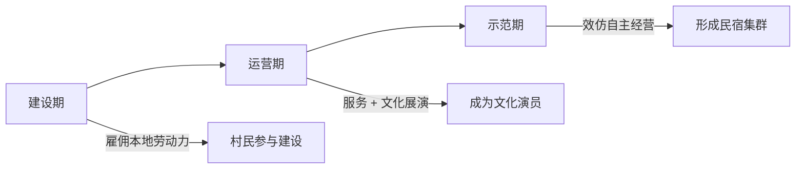
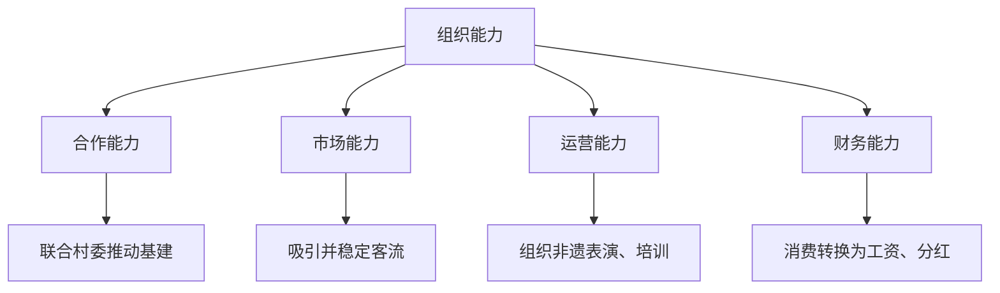
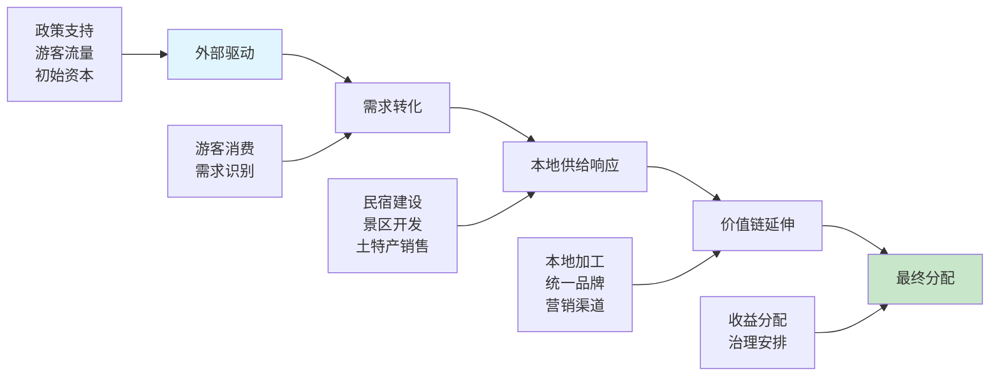

## 🌟 研究背景

> **一句话总结**：民宿产业火了，但农户真的赚到钱了吗？组织和制度在其中扮演了什么角色？

随着乡村振兴战略推进，文旅产业已成为民族地区乡村发展的重要引擎。民宿集群经济迅速发展，但农户在参与过程中仍面临**收益不稳定、产业链延伸有限**等困境。

**核心研究问题**：
- 🤔 在文旅驱动型的民族地区乡村发展中，民宿集群经济如何带动农户增收？
- 🤔 组织能力与制度规则发挥什么作用？

---

## 📍 田野点概况

**研究地点**：广西金秀瑶族自治县 L 乡

| 指标 | 数据 |
|------|------|
| 🏛️ 行政地位 | 全国第一个瑶族自治县 |
| 👥 瑶族人口 | 61,289 人（占 40%） |
| 🌲 品牌优势 | "生态、民族、长寿" |
| 💰 全乡民宿收入 | 年增收约 300 多万元 |

**案例村落对比**：

```
┌─────────────────────────────────────────────────────────┐
│  🏘️ X 村                          🏘️ D 村              │
│  • L 乡政府驻地                   • 国家 AAAA 级景区南麓  │
│  • 501 户 1470 人                 • 117 户 386 人        │
│  • 2024 年集体经济 9.19 万元        • 2024 年旅游收入 700 万│
│  • "中国民间文化艺术之乡"          • 费孝通赞"世外桃源"   │
└─────────────────────────────────────────────────────────┘
```

---

## 🔍 核心发现

### 1️⃣ 外部企业的示范带动效应

Y 企业作为"外来组织主体"，通过**三阶段带动机制**激发村民参与：



**分红模式**：
> 💡 **固定分红**：村民以闲置房屋入股，每年按固定标准获取分红，不参与实际管理。
> 
> ✅ 优点：避免产权纠纷，维护村企关系稳定
> 
> ⚠️ 局限：限制了农户对经营过程的参与和监督

---

### 2️⃣ 村级组织的初级联结

当前村级组织力量仍处于**初级阶段**：

| 问题 | 表现 |
|------|------|
| 📉 收入来源单一 | 以入股文旅项目为主，"一荣俱荣，一损俱损" |
| 🏗️ 农民合作社缺位 | 人口基数少、动员能力不足 |
| 🔄 村委角色转型中 | 从行政管理者→多元服务者，但产业引导能力有限 |

> 💬 **村民原话**：
> > "像我们没有开发这些旅游资源之前，村集体收入反正都没有。"（0728_1）

---

### 3️⃣ 家庭民宿的松散模式

个体经营民宿呈现"**高普及率、低协同性、弱可持续性**"特征：

**📊 D 村民宿数据**：
- 不到 400 人 → 已有约 14 家个体民宿
- 经营人口占比 **60% 以上**
- 缺乏统一标准、市场定位和营销策略
- 客源以回头客为主，数字营销能力缺乏

**💡 但社会网络发挥了重要作用**：

```
🤝 社会互助网络
   └─→ 农产品代销：民宿经营者优先采购本地村民农产品

👨‍👩‍👧 亲属网络
   └─→ 价格协调：基于亲属关系避免恶性竞争
```

> 💬 **村民原话**：
> > "抢客倒是没有，这个真的没有了，因为我们全村都是统一的，比如说都是亲戚什么的，你抢客的话到时候一传出去，人家要说你的。"（0728_3）

---

### 4️⃣ 组织能力的四个维度

组织能力是文旅价值能否在地化并向农户下沉的**首要中介**：



**⚖️ 能力分化导致收益质量差异**：

| 主体类型 | 能力水平 | 收益特征 |
|---------|---------|---------|
| 🏢 企业（高能力） | 强 | 把价值固化为**长期性收益** |
| 🏠 家庭民宿（低能力） | 弱 | 获得**一次性、季节性、低附加值**收入 |

---

### 5️⃣ 制度约束与适应性策略

**🛡️ 制度双刃剑**：

| 制度因素 | 约束作用 | 适应性创新 |
|---------|---------|-----------|
| 🌳 保护区红线 | 限制大规模投资 | "微改造"确保生态原则 |
| 🛣️ 交通条件 | 提高运营成本 | 精准识别政策边界 |
| 💸 政策补贴 | 门槛过高 | 多数小农户难以获得 |

**🧠 农户的适应性策略**：

```
┌────────────────────────────────────────────────────┐
│  1. 市场适应                                       │
│     • 差异化定位：企业做中高端，村民补充差异化需求   │
│     • 价格协调机制：亲属网络避免恶性竞争            │
├────────────────────────────────────────────────────┤
│  2. 社会支持                                       │
│     • 代销服务：优先采购本地农产品                 │
│     • 亲友融资：基于信任的非正式融资机制            │
├────────────────────────────────────────────────────┤
│  3. 风险分散                                       │
│     • 多元经营："民宿 + 餐饮 + 农产品销售"          │
│     • 灵活调整：市场饱和时缩小规模或转行            │
└────────────────────────────────────────────────────┘
```

---

## 🧩 理论框架

**农户收益影响机制路径**：



**🎯 组织与制度的双重调节**：

> ✅ **理想状态**：组织存在 + 能力强大 + 制度环境适宜  
> → 外部驱动力有效转化为**长期收益**
> 
> ❌ **问题状态**：组织薄弱 或 制度约束过强  
> → 产业价值链断裂与**收益外溢**

---

## 💡 结论与启示

农户收益并非简单的线性传递过程，而是受到**组织能力与制度环境双重调节**的复杂系统。

**🚀 乡村振兴的关键**：

1. 🌱 **培育本土组织力量**：提升组织能力和合作水平
2. ⚖️ **优化制度设计**：充分考虑民族地区特殊性
3. 💰 **完善收益分配机制**：让农户分享产业链增值收益
4. 👥 **尊重村民主体性**：将适应性策略与系统性支持结合

---

## 📚 研究信息

| 项目 | 内容 |
|------|------|
| 🎓 作者 | 陈仪真（中央民族大学硕士研究生） |
| 🏫 单位 | 中央民族大学民族学与社会学学院 |
| 📍 田野点 | 广西金秀瑶族自治县 L 乡 |
| ⏱️ 调研时间 | 约 1 个月实地驻点 |
| 🔬 研究方法 | 参与式观察、非结构化访谈、实物分析 |

**关键词**：`民宿集群` `组织能力` `制度` `农户` `乡村振兴`

---

*本文基于乡村振兴年会征文论文整理，原文标题：《组织与制度之力：民族地区乡村民宿产业发展下的农户收益机制研究——以广西金秀 L 乡为例》*
